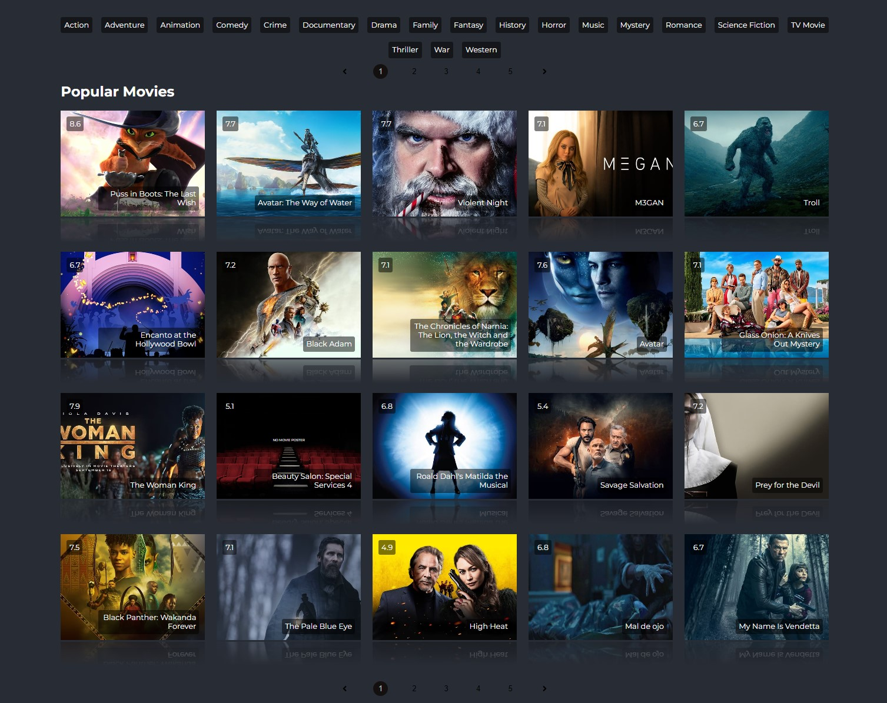

# Movie Web

## Table of contents

- [Overview](#overview)
  - [The challenge](#the-challenge)
  - [Screenshot](#screenshot)
  - [Links](#links)
- [My process](#my-process)
  - [Built with](#built-with)

## Overview

### Website features

Movie website with features:

- search movies
- get movies by genres
- view selected movie details, trailer

### Screenshot

### Links

- Live Site URL on Netlify: [here](https://serene-lebkuchen-966263.netlify.app/)

## My process

### Built with

- Semantic HTML5 markup
- Flexbox
- Grid
- BEM
- [React](https://reactjs.org/) - JS library
- https://developers.themoviedb.org/ API
